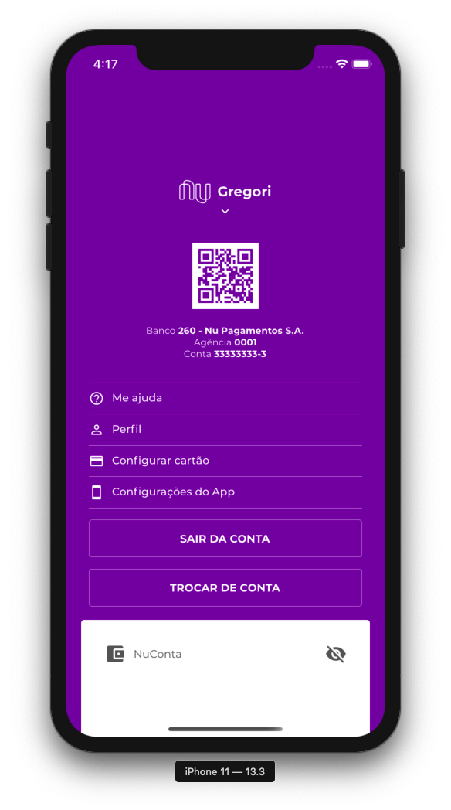

<!-- PROJECT LOGO -->
<br />
<p align="center">
  <h1 align="center">Nubank Clone</h1>
</p>

<!-- ABOUT THE PROJECT -->

## About

This project is a Nubank interface clone and is made with Animations (Animated) on React Native.

### Screenshots

<div style="display: flex; flex-direction: row;">
  
  
  
</div>

### Made With

- [React Native](http://facebook.github.io/react-native/)
- [React Native Gesture Handler](https://kmagiera.github.io/react-native-gesture-handler/)
- [Babel](https://babeljs.io/)
  - [babel-eslint](https://github.com/babel/babel-eslint)
  - [babel-plugin-root-import](https://github.com/entwicklerstube/babel-plugin-root-import)
- [Eslint](https://eslint.org/)
  - [eslint-config-airbnb](https://github.com/airbnb/javascript/tree/master/packages/eslint-config-airbnb)
  - [eslint-plugin-import](https://github.com/benmosher/eslint-plugin-import)
  - [eslint-plugin-jsx-a11y](https://github.com/evcohen/eslint-plugin-jsx-a11y)
  - [eslint-plugin-react](https://github.com/yannickcr/eslint-plugin-react)
  - [eslint-plugin-react-native](https://github.com/Intellicode/eslint-plugin-react-native)
  - [eslint-import-resolver-babel-plugin-root-import](https://github.com/olalonde/eslint-import-resolver-babel-root-import)
- [EditorConfig](https://editorconfig.org/);

<!-- GETTING STARTED -->

## Getting Started

### Pre

You just need Yarn and React Native CLI to use this repo.

### Install

1. Made a clone repo using your terminal

```
$ git clone https://github.com/gregorispielmann/nubank-clone.git
```

2. Run yarn to install dependencies

```
$ yarn
```

3. If you want to run the iOS project then you need to run the command below

```
$ cd ios && pod install && cd ..
```

---

<!-- CONTACT -->

## Contact

Gregori Spielmann - [Github](https://github.com/gregorispielmann)
